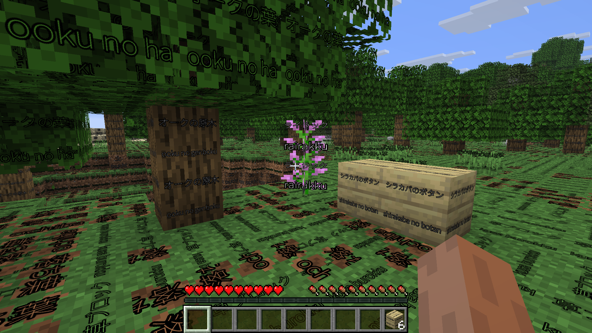
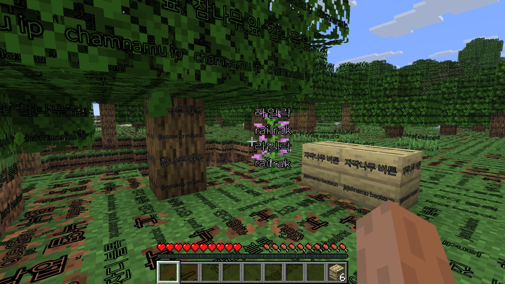

# minecraft-language-learn-texture-pack

Generates a Minecraft resource pack that stamps every visible block face with
its name in a language you're learning -- so placing an oak log in survival
also teaches you the word for it.

Inspired by [chinese-for-learners-minecraft-language-pack](https://github.com/LAntoine/chinese-for-learners-minecraft-language-pack).

## Screenshots

| Japanese (`ja_jp`) | Korean (`ko_kr`) |
|---|---|
|  |  |

## How it works

1. **`fetch_jar.py`** downloads a Minecraft version's client jar straight
   from Mojang's public version manifest (the same endpoints the vanilla
   launcher uses) and extracts its `assets/` into `jar/<version>/`.
2. **`build_block_textures.py`** resolves `blockstates/*.json` and
   `models/block/*.json` from that extracted jar to work out exactly which
   texture files are real, visible block faces (as opposed to GUI sprites,
   entity skins, particles, animation strips, etc.) and which block id each
   one belongs to. Output: `data/block_textures_<version>.json`. Only needs
   to be run once per Minecraft version, not per language.
3. **`fetch_lang.py`** pulls an official Mojang translation file for a given
   language out of your local Minecraft install (see below for why this is
   needed). Output: `jar/<version>/assets/minecraft/lang/<language>.json`.
   For a language Mojang doesn't support, **`make_lang_template.py`** writes
   a fill-in-the-blanks lang file to that same path instead.
4. **`generate_pack.py`** stamps the translated word onto each labeled
   texture (auto-shrinking/wrapping the font to fit) and zips the result into
   a resource pack. **`make_contact_sheet.py`** is optional here -- it lays
   out before/after images of a whole generated pack into a grid so you can
   review font sizing/wrapping/glyph issues across every block at once,
   without launching Minecraft.
5. **`install_pack.py`** copies that zip into Minecraft's `resourcepacks/`
   folder for you.

`fetch_jar.py`, `build_block_textures.py`, `fetch_lang.py`, and
`generate_pack.py` all require `--version` -- there's no default. Pass the
same one consistently across all of them for a given run; a mismatched or
forgotten one fails loudly instead of silently building the wrong version's
pack. `fetch_lang.py`, `generate_pack.py`, and `install_pack.py` also
require `--language` (`install_pack.py` doesn't need `--version` since it
just moves a file that's already built).

## Setup

```
pip install -r requirements.txt
```

## Generating a pack

### 1. Get the game assets for your Minecraft version

```
python fetch_jar.py --version 1.21.4
```

Downloads that version's client jar from Mojang and extracts
`assets/minecraft/...` (`blockstates/`, `models/`, `textures/`, ...) into
`jar/1.21.4/`. Only needs to be done once per version.

### 2. Build the block/texture manifest (once per Minecraft version)

```
python build_block_textures.py --version 1.21.4
```

### 3. Get a translation file for your language

Mojang's client jar only ships `en_us.json` -- every other language is
downloaded on demand by the launcher, once you've selected it in-game.

1. In Minecraft: **Options > Language**, select your target language, then
   quit (this makes the launcher actually download that language's assets).
2. Run:

```
python fetch_lang.py --language de_de --version 1.21.4
```

This finds the file in your `.minecraft` folder (auto-detected per OS,
override with `--minecraft-dir`) via the version's asset index and copies it
into `jar/<version>/assets/minecraft/lang/`. See `python fetch_lang.py --help`
for all options (matching a specific version folder, passing a known asset
index id directly, etc).

**If you only have a modded launcher profile installed** (OptiFine, Forge,
Fabric, ...) and not plain vanilla -- e.g. `.minecraft/versions/` only has
`OptiFine 1.21.8`, not `1.21.8` -- keep `--version` as the clean id (so it
still lines up with `fetch_jar.py`/`build_block_textures.py`/
`generate_pack.py`, which only ever talk to Mojang directly and don't care
about your local install) and point the local lookup at the profile folder
separately:

```
python fetch_lang.py --language fr_fr --version 1.21.8 --local-version-dir "OptiFine 1.21.8"
```

Use the [Minecraft language code](https://minecraft.wiki/w/Language) for the
language you want, e.g. `es_es` (Spanish), `fr_fr` (French), `ja_jp` (Japanese).

#### Languages Minecraft doesn't support, or fixing an existing translation

For a language Mojang doesn't ship at all, or to hand-fix specific words in
one you already fetched, use `make_lang_template.py` instead of
`fetch_lang.py`. It writes a lang file to the same place (`jar/<version>/
assets/minecraft/lang/<language>.json`), so `generate_pack.py` treats it
identically either way -- it has no idea whether a file came from Mojang or
from you.

```
python build_block_textures.py --version 1.21.4   # needed first, if you haven't already
python make_lang_template.py --version 1.21.4 --language tlh_aa
```

This creates a JSON file with one `"block.minecraft.<id>": ""` entry per
block this project knows how to label (pulled from
`data/block_textures_<version>.json`) -- open it and fill in each value by
hand. `--language` can be a real Minecraft code you want to override, or a
made-up one for a language Minecraft doesn't support at all (any string
works, since `generate_pack.py` never validates it against a list of real
codes -- it just needs a matching lang file to exist).

Two more flags:
- `--prefill-english` fills every entry with its English text from
  `en_us.json` instead of leaving it blank, so you're translating each line
  rather than needing `en_us.json` open in another tab to know what each
  block id even means.
- `--force` overwrites a lang file that's already there (e.g. to regenerate
  a template, or intentionally clobber a real fetched one you want to
  hand-edit from scratch).

To fix just a few words in an existing lang file without regenerating
anything, it's a plain JSON file -- open
`jar/<version>/assets/minecraft/lang/<language>.json` in any editor and
change the values directly, then rerun `generate_pack.py`.

### 4. Generate the pack

```
python generate_pack.py --language de_de --version 1.21.4
```

Produces `output/language-learn-1.21.4-de_de/` (unzipped) and
`output/language-learn-1.21.4-de_de.zip` -- the version is baked into the
name so packs for different versions (or different languages) don't
overwrite each other. Blocks with no translation entry in the lang file are
skipped and listed in the console output rather than silently mislabeled.
`pack.mcmeta`'s `pack_format` is looked up automatically from
[`data/pack_formats.json`](data/pack_formats.json) (version ranges scraped
from the Minecraft Wiki's ["Pack format"](https://minecraft.wiki/w/Pack_format)
page -- covers 1.6.1 through the current version at the time it was pulled);
pass `--pack-format` yourself for any version released after that, or one
outside every listed range. `pack.png` is generated too -- a
tinted grass-block-top texture labeled with the language's English name and,
when the lang file has one, its native name from its own `language.name`
key (e.g. "German" / "Deutsch") -- so the pack is identifiable in Minecraft's
resource pack list instead of showing a generic icon.

#### Texture resolution

Each 16x16 source texture is upscaled `--scale` times (nearest-neighbor, so
the pixel art stays crisp, not blurry) before text gets stamped on, giving
the label room to be legible. Default is `--scale 16` -> 256x256 output.
Bump it for more room (e.g. `--scale 32` -> 512x512) or drop it for smaller
files (e.g. `--scale 8` -> 128x128, this project's original default).

Worth knowing: a resource pack's block textures all get loaded into
Minecraft's texture atlas, and this is a *labeled-block* pack -- every block
this project touches (potentially several hundred) ships at the chosen
resolution, not just a handful. This is the same tradeoff any "HD" texture
pack makes: higher resolution means more texture memory and longer atlas/
mipmap generation, which can mean longer world-load times or stutter on
lower-end GPUs. Nobody's benchmarked this yet for this project specifically
-- if `--scale 16` turns out to be noticeably heavy in practice, the next
step would be sizing textures per-block based on how much text actually
needs to fit (a short word like "Erde" doesn't need the same resolution as
something that wraps to two lines) rather than one fixed scale for every
block regardless of content -- not built, since there's nothing to fix yet.

#### Optional: review it before installing

```
python make_contact_sheet.py --language de_de --version 1.21.4
```

Lays out every stamped block as a before/after pair in a grid, written to
`output/contact-sheets-1.21.4-de_de/sheet-01.png` (and further `sheet-02.png`
etc. if there are more blocks than fit on one page -- `--per-page` controls
how many, default 60). Useful for spotting font/wrapping/glyph problems
across the whole pack in a couple of images instead of hunting through the
world in Minecraft block by block.

### 5. Install it

```
python install_pack.py --language de_de --version 1.21.4
```

Copies `output/language-learn-1.21.4-de_de.zip` into
`<.minecraft>/resourcepacks/` (auto-detected per OS, same as
`fetch_lang.py`). Add `--move` to remove it from `output/` after copying
instead of leaving it in place, or `--resourcepacks-dir` to install straight
into a modded launcher instance (MultiMC/Prism/CurseForge/...) that keeps
resource packs outside the shared `.minecraft` folder.

Then in Minecraft: **Options > Resource Packs**, enable it from the list.

Alternatively, skip the script and drag the `.zip` yourself into **Options >
Resource Packs > Open Pack Folder**.

### Beyond blocks: items, verbs

This project deliberately only labels blocks, not items or verbs:

- **Items**: skipped on purpose, not just unimplemented. Item names are
  already exposed via their tooltip whenever the game itself is set to your
  target language (Options > Language) -- no custom pack needed for that.
  Blocks don't have that: you only see a block's name in a tooltip while
  it's in your inventory, not while it's placed and you're looking at it in
  the world, which is the actual gap this project fills. A held/actively-used
  item (a pickaxe you're swinging for ten minutes) would also just be visual
  noise if labeled.
- **Verbs/actions**: turn on **Options > Accessibility > Subtitles** (with
  the game set to your target language) instead of expecting a texture pack
  to help here. Minecraft already ships professionally-translated subtitle
  text tied to real gameplay events (`"subtitles.block.generic.break":
  "Block broken"`, `"subtitles.entity.player.attack.crit": "Critical
  attack"`, ...) for every supported language -- that's the actual built-in
  mechanism for action/verb vocabulary, not something a static image pack
  could replicate.

## Fonts

Latin scripts (Spanish, French, German, ...) work with zero setup, falling
back to a system font (Consolas / Lucida Console / Courier New on Windows),
or `Monocraft.ttf` automatically if it's present in `fonts/`, for a look
closer to Minecraft's own typeface.

Non-Latin scripts need a font with the right glyphs, but for `ja_jp`,
`zh_cn`, and `ko_kr` that's automatic too -- `data/font_map.json` maps each
to a font already in `fonts/`, so this just works with no extra flag:

```
python generate_pack.py --language ja_jp --version 1.21.4
```

For a language not in that map yet, `--font` overrides everything:

```
python generate_pack.py --language ar_sa --version 1.21.4 --font fonts/SomeArabicFont.ttf
```

See [`fonts/README.md`](fonts/README.md) for what's already mapped, where to
download open-source fonts for other scripts (Chinese Traditional, Kannada,
...), and how to add a new language to the map (two steps: drop the font in
`fonts/`, add one line to `font_map.json`).

## Transliteration

`--transliterate` stamps a romanization under the word, for languages that
have a well-defined one:

| Language | Romanization | Library |
|---|---|---|
| `zh_cn` / `zh_tw` | Pinyin | [`pypinyin`](https://pypi.org/project/pypinyin/) |
| `ja_jp` | Romaji (Hepburn) | [`pykakasi`](https://pypi.org/project/pykakasi/) |
| `ko_kr` | Revised Romanization | [`korean-romanizer`](https://pypi.org/project/korean-romanizer/) |

These aren't in `requirements.txt` -- they're optional extras in
`pyproject.toml`, since each is a real dependency most installs (anyone not
generating one of these three languages) will never use:

```
pip install -e ".[ja]"             # just Japanese
pip install -e ".[zh]"             # just Chinese
pip install -e ".[ko]"             # just Korean
pip install -e ".[transliterate]"  # all three
```

Then:

```
python generate_pack.py --language ja_jp --version 1.21.4 --font fonts/NotoSansJP-VariableFont_wght.ttf --transliterate
```

`--transliterate` on a language with no romanization registered (anything
other than the three above) is a harmless no-op -- word-only, same as
without the flag, not an error. If the matching library isn't installed,
you get a clear message telling you which `pip install -e ".[...]"` to run,
not a raw traceback.
